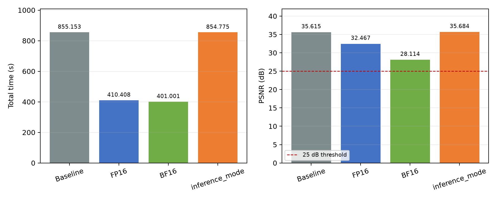

# Embodied World Model 推理优化

姓名：乔可傲  
年级专业：24绿算  
大题：Embodied World Model

本仓库保存最终选拔大题的运行脚本、源码补丁、关键日志和结果。模型权重、输入数据和输出视频未上传。

## 项目与环境

- 赛题仓库：<https://github.com/ASC-Competition/ASC26-Embodied-World-Model-Optimization>
- 项目仓库：<https://github.com/unitreerobotics/unifolm-world-model-action>
- 项目提交：`3e198de68de55f93f24b3ad623dd499390aaee45`
- 场景与 Case：`unitree_g1_pack_camera/case1`

| 项目 | 内容 |
| --- | --- |
| 机器来源 | 自备付费云服务器（AutoDL） |
| 操作系统 | Ubuntu 22.04.1 LTS |
| CPU | Intel Xeon Gold 6348，分配 14 vCPU |
| 内存 | 120 GiB |
| GPU | NVIDIA A800 80GB PCIe |
| Python | 3.10.18 |
| PyTorch | 2.3.1+cu121 |
| CUDA | PyTorch CUDA 12.1 |

模型权重从 [UnifoLM-WMA-0-Dual](https://huggingface.co/unitreerobotics/UnifoLM-WMA-0-Dual) 获取，放在 `ckpts/unifolm_wma_dual.ckpt`。Case 输入从赛题仓库获取，按 `unitree_g1_pack_camera/case1/` 放置。仓库中的 `input_sha256.txt` 可以核对各次实验是否使用了相同输入和权重。

## 运行方法

Baseline：

```bash
bash scripts/run_case1_experiment.sh baseline_a800_20260813_02
```

FP16：

```bash
WMA_AMP_DTYPE=fp16 \
bash scripts/run_case1_experiment.sh amp_fp16_a800_20260813_01
```

BF16：

```bash
WMA_AMP_DTYPE=bf16 \
bash scripts/run_case1_experiment.sh bf16_a800_20260824_01
```

`torch.inference_mode()`：

```bash
WMA_INFERENCE_MODE=1 \
bash scripts/run_case1_experiment.sh inference_mode_a800_20260824_01
```

优化参数由 `patches/wma_optimizations.patch` 增加。补丁可以在项目提交 `3e198de...` 上直接应用：

```bash
git apply patches/wma_optimizations.patch
```

## 性能分析

Baseline 完整计时为 855.153 s。`tqdm` 记录的 11 轮主循环约为 771.1 s，占总时间约 90.17%；完整运行期间 GPU 平均利用率为 85.09%。每轮会执行两次 50 步 DDIM 采样，所以主要时间花在 GPU 推理计算中。

## 三种优化尝试

| 实验 | 修改 | 运行时间 / s | 加速比 | PSNR / dB | 视频 |
| --- | --- | ---: | ---: | ---: | --- |
| Baseline | 无 | 855.153 | 1.000× | 35.615362 | 正常，176 帧 |
| FP16 | CUDA autocast FP16 | 410.408 | 2.084× | 32.466923 | 正常，176 帧 |
| BF16 | CUDA autocast BF16 | 401.001 | 2.133× | 28.113758 | 正常，176 帧 |
| inference_mode | `torch.inference_mode()` | 854.775 | 1.000× | 35.683527 | 正常，176 帧 |



FP16 和 BF16 都明显降低了完整运行时间。本次记录中 BF16 的总时间最短，PSNR 仍高于 25 dB，但它比 FP16 多损失约 4.35 dB。`torch.inference_mode()` 只快了 0.378 s，变化约 0.04%，不能认为有实际加速。项目内部本来已经在多个推理函数中使用 `torch.no_grad()`，因此进一步关闭自动求导记录没有改变主要计算量。

如果同时考虑输出质量，FP16 的速度与质量更均衡。

## 正确性验证

四次实验的输入和权重哈希一致，程序都正常完成 11 轮并生成 H.264、512×320、8 FPS、176 帧、22 秒的视频。PSNR 使用同一个 `psnr_score_for_challenge.py` 计算，评价方式没有修改。

Baseline 和 FP16 在 8 月 13 日运行，BF16 和 `inference_mode()` 在 8 月 24 日使用相同磁盘镜像重新创建的服务器上运行。GPU 型号、Python、PyTorch、CUDA、代码提交和输入哈希相同；GPU 驱动分别为 590.48.01 和 595.71.05。每组只完整运行一次，所以不根据 BF16 与 FP16 的小幅时间差判断两种精度本身的性能高低。

## 文件说明

- `patches/`：优化源码补丁。
- `scripts/`：统一实验脚本，自动记录时间、GPU、PSNR、视频信息和输入哈希。
- `results/summary.csv`：四组结果汇总。
- `results/<experiment>/`：运行日志、GPU 记录、PSNR、视频信息和复现信息。`environment.txt` 的标题由培训提供的环境采集脚本生成，文件中的系统信息对应实际云服务器。
- `figures/`：结果对比图。
